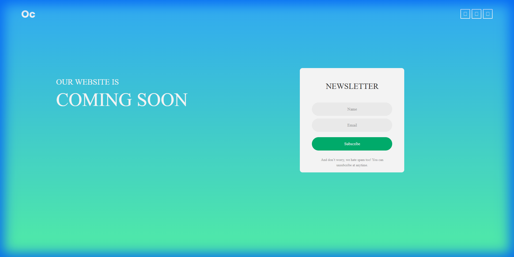

# Coming Soon 6



## Overview

**Coming Soon 6** is a sleek and modern "Coming Soon" landing page template designed to captivate your audience before your official launch. With a clean aesthetic and responsive design, it ensures your brand looks professional on all devices.

## Features

*   **Stunning Visuals:** Full-screen background image with an overlay for better text readability.
*   **Social Connectivity:** Integrated social media icons (Facebook, Twitter, YouTube) to grow your community.
*   **Lead Generation:** A built-in newsletter subscription form to collect emails from interested visitors.
*   **Countdown Timer:** A placeholder for a countdown timer to build anticipation for your launch date.
*   **Responsive Design:** Fully responsive layout that adapts to desktops, tablets, and mobile phones.

## Getting Started

1.  **Clone the repository:**
    ```bash
    git clone https://github.com/yourusername/coming-soon-6.git
    ```
2.  **Open the project:**
    Navigate to the project directory and open `index.html` in your web browser.
3.  **Customize:**
    *   **Background:** Replace `images/bg01.jpg` with your own image.
    *   **Logo:** Update `logo/logo.png` with your brand's logo.
    *   **Links:** Edit the `href` attributes in `index.html` to point to your social media profiles.
    *   **Timer:** Implement the countdown logic in the JavaScript files (or add a new script) to activate the timer.

## Creator Information

*   **Created By:** Muhammad Hasan (HexStacker)
*   **Contact:** hexstacker.freelance@gmail.com
*   **Website:** hexstacker.com
*   **GitHub:** hexstacker

## License

This project is licensed under the MIT License - see the [LICENSE](LICENSE) file for details.
